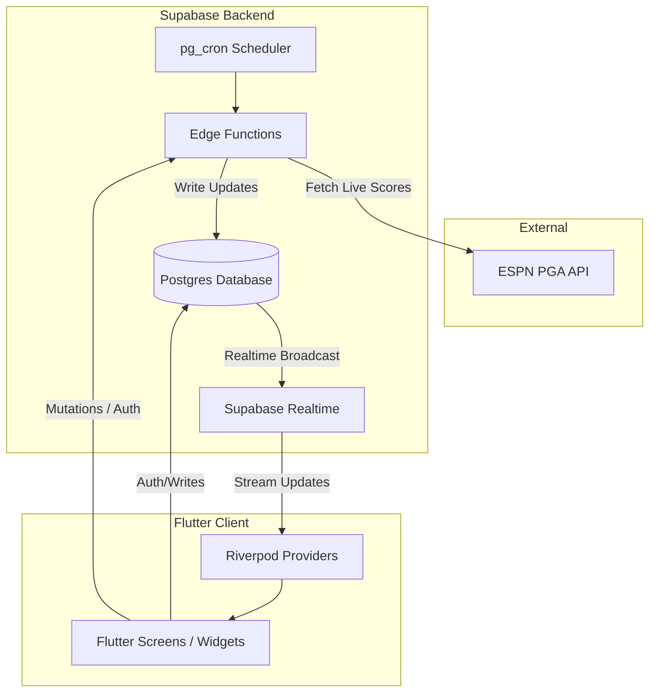
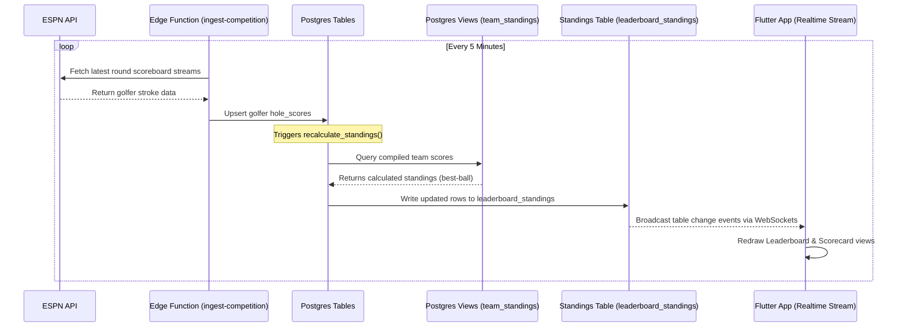
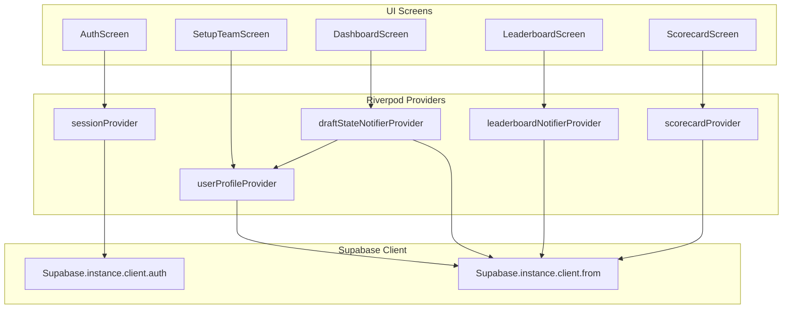

# FattyGolf Codebase Map & Agent Graph

This document serves as a comprehensive system guide and dependency graph for human developers and AI coding agents. It explains the design patterns, data flows, folder structures, and interaction models of the **Best Ball Madness (FattyGolf)** application.

---

## 1. Architectural Overview

FattyGolf is built with a decoupled client-server architecture:
* **Frontend**: Flutter Web/Mobile client using **Riverpod** for declarative state management, adhering to a strict separation of UI and business logic.
* **Backend**: **Supabase** providing PostgreSQL database, GoTrue Authentication, Edge Functions (Deno/TypeScript), pg_cron weekly job scheduling, and PostgreSQL Realtime subscriptions.
* **External API**: ESPN Public PGA API for live tournament scoring and leaderboard data.



---

## 2. Directory Layout & File Reference

### Frontend: `/best-ball-madness/lib`

All application logic resides in `lib/`, organized by role:

* **`main.dart`**: Application entrypoint. Configures the Riverpod `ProviderScope`, initializes Supabase, sets up routing, and applies global theme constraints.
* **`models/`**: Strongly-typed Dart data models with JSON serialization:
  * [`draft_models.dart`](file:///Users/rusty/Development/FattyGolf/best-ball-madness/lib/models/draft_models.dart): GolferProfile, Tournament, Team, and DraftState models.
  * [`leaderboard_models.dart`](file:///Users/rusty/Development/FattyGolf/best-ball-madness/lib/models/leaderboard_models.dart): Standings records and team scoring arrays.
  * [`scorecard_models.dart`](file:///Users/rusty/Development/FattyGolf/best-ball-madness/lib/models/scorecard_models.dart): Detailed hole scores and scorecard metrics.
* **`providers/`**: Riverpod state management files (no business logic in widgets):
  * [`auth_providers.dart`](file:///Users/rusty/Development/FattyGolf/best-ball-madness/lib/providers/auth_providers.dart): App auth state, active session, and current user profile metadata.
  * [`draft_providers.dart`](file:///Users/rusty/Development/FattyGolf/best-ball-madness/lib/providers/draft_providers.dart): Roaster budget calculations, golfer search/filters, and team saving mutations.
  * [`leaderboard_providers.dart`](file:///Users/rusty/Development/FattyGolf/best-ball-madness/lib/providers/leaderboard_providers.dart): Realtime leaderboard standings subscriptions and tie-breaker sorting.
  * [`scorecard_providers.dart`](file:///Users/rusty/Development/FattyGolf/best-ball-madness/lib/providers/scorecard_providers.dart): Live scorecard stream provider and active hole-by-hole statistics.
* **`screens/`**: High-level page wrappers:
  * `auth/`:
    * [`auth_screen.dart`](file:///Users/rusty/Development/FattyGolf/best-ball-madness/lib/screens/auth/auth_screen.dart): Sign In, Sign Up, and email confirmation prompt states.
    * [`setup_team_screen.dart`](file:///Users/rusty/Development/FattyGolf/best-ball-madness/lib/screens/auth/setup_team_screen.dart): Post-signup team registration gate (forces unique team name).
  * `dashboard/`:
    * [`dashboard_screen.dart`](file:///Users/rusty/Development/FattyGolf/best-ball-madness/lib/screens/dashboard/dashboard_screen.dart): Renders active tournament info, drafting panel, and golfer grid.
  * `leaderboard/`:
    * [`leaderboard_screen.dart`](file:///Users/rusty/Development/FattyGolf/best-ball-madness/lib/screens/leaderboard/leaderboard_screen.dart): Displays the tournament-wide ranking.
  * `scorecard/`:
    * [`scorecard_screen.dart`](file:///Users/rusty/Development/FattyGolf/best-ball-madness/lib/screens/scorecard/scorecard_screen.dart): Details round-by-round strokes and score colors for drafted players.
* **`theme/`**: Theme tokens representing PGA Tour brand aesthetics (pure white backgrounds, deep greens, charcoal text, and responsive typography guidelines).
  * [`colors.dart`](file:///Users/rusty/Development/FattyGolf/best-ball-madness/lib/theme/colors.dart), [`spacing.dart`](file:///Users/rusty/Development/FattyGolf/best-ball-madness/lib/theme/spacing.dart), [`typography.dart`](file:///Users/rusty/Development/FattyGolf/best-ball-madness/lib/theme/typography.dart), [`theme.dart`](file:///Users/rusty/Development/FattyGolf/best-ball-madness/lib/theme/theme.dart).
* **`widgets/`**: Reusable component-level UI:
  * [`responsive_layout.dart`](file:///Users/rusty/Development/FattyGolf/best-ball-madness/lib/widgets/responsive_layout.dart): Centers layouts on desktop and scales appropriately to mobile-first 375px widths.
  * [`golfer_table.dart`](file:///Users/rusty/Development/FattyGolf/best-ball-madness/lib/widgets/golfer_table.dart): Searchable and filterable grid of golfers available for draft.
  * [`draft_panel.dart`](file:///Users/rusty/Development/FattyGolf/best-ball-madness/lib/widgets/draft_panel.dart): Shows selected roster progress, overall budget, and save commands.
  * [`tournament_header.dart`](file:///Users/rusty/Development/FattyGolf/best-ball-madness/lib/widgets/tournament_header.dart): Lock countdown, course metadata, and lock time banner.
  * [`badge.dart`](file:///Users/rusty/Development/FattyGolf/best-ball-madness/lib/widgets/badge.dart), [`button.dart`](file:///Users/rusty/Development/FattyGolf/best-ball-madness/lib/widgets/button.dart), [`card.dart`](file:///Users/rusty/Development/FattyGolf/best-ball-madness/lib/widgets/card.dart), [`skeleton.dart`](file:///Users/rusty/Development/FattyGolf/best-ball-madness/lib/widgets/skeleton.dart), [`table.dart`](file:///Users/rusty/Development/FattyGolf/best-ball-madness/lib/widgets/table.dart).

---

### Backend: `/best-ball-madness/supabase`

* **`migrations/`**: SQL scripts establishing schemas, triggers, indexes, and views.
  * [`20260610011628_init.sql`](file:///Users/rusty/Development/FattyGolf/best-ball-madness/supabase/migrations/20260610011628_init.sql): Initial table architecture (`users`, `tournaments`, `golfer_profiles`, `tournament_golfers`, `teams`, `team_golfers`, `hole_scores`, `tee_times`) and SQL scoring views.
  * [`20260614132000_grants.sql`](file:///Users/rusty/Development/FattyGolf/best-ball-madness/supabase/migrations/20260614132000_grants.sql): Security access and schema permissions.
  * [`20260614141600_functions.sql`](file:///Users/rusty/Development/FattyGolf/best-ball-madness/supabase/migrations/20260614141600_functions.sql): Recalculation logic trigger functions for the `leaderboard_standings` table.
  * [`20260614141700_cron_setup.sql`](file:///Users/rusty/Development/FattyGolf/best-ball-madness/supabase/migrations/20260614141700_cron_setup.sql): Weekly automation job schedules using pg_cron.
  * [`20260616003059_security_invoker_views.sql`](file:///Users/rusty/Development/FattyGolf/best-ball-madness/supabase/migrations/20260616003059_security_invoker_views.sql): Sets Postgres views to invoke security rules relative to current user role.
* **`functions/`**: Deno TypeScript edge runtimes:
  * [`ingest-competition`](file:///Users/rusty/Development/FattyGolf/best-ball-madness/supabase/functions/ingest-competition/index.ts): Resolves round-by-round scoreboard streams from ESPN.
  * [`ingest-tournament-field`](file:///Users/rusty/Development/FattyGolf/best-ball-madness/supabase/functions/ingest-tournament-field/index.ts): Ingests the golfer roster for the active tournament.
  * [`run-pricing-algorithm`](file:///Users/rusty/Development/FattyGolf/best-ball-madness/supabase/functions/run-pricing-algorithm/index.ts): Computes pricing rules based on current rankings.
  * [`lock-teams`](file:///Users/rusty/Development/FattyGolf/best-ball-madness/supabase/functions/lock-teams/index.ts): Enforces locks on team creation once the event begins.
  * [`update-golfer-stats`](file:///Users/rusty/Development/FattyGolf/best-ball-madness/supabase/functions/update-golfer-stats/index.ts): Pulls season metrics post-event.

---

## 3. Data Flow & Scoring Pipeline

FattyGolf uses a push-based scoring pipeline to ensure high performance on the client. Business logic is executed on the server, and results are cached into a physical table (`leaderboard_standings`) which broadcasts changes to client subscribers.



### The Best-Ball Scoring Pipeline:
1. **`team_hole_scores` View**: Takes team rosters from `team_golfers` and groups their hole-by-hole scores (`hole_scores`). Computes the minimum strokes (`MIN(score)`) among all playing team members for each hole, determining the team's best-ball score.
2. **`team_round_scores` View**: Groups `team_hole_scores` by team and round to aggregate To-Par scores (`SUM(hole_to_par)`).
3. **`team_standings` View**: Combines round scores, generates a sorted array of rounds (for tiebreaker sorting), calculates total team budget used, and maps active statuses.
4. **`leaderboard_standings` Table**: Views cannot broadcast realtime messages in Supabase. Thus, a trigger copies the results of `team_standings` into a physical table `leaderboard_standings` after scoring runs complete.

---

## 4. Frontend State Dependency Graph

Riverpod providers manage data flow between the user interface and the local/remote backend state.



---

## 5. Roster Validation Rules

Before a draft is committed, the client and server enforce the following constraints:
* ** Roster Capacity**: Exactly **4 golfers** must be drafted.
* **Salary Cap**: Total cost of the 4 golfers must be **less than or equal to $100**.
* **Lock State**: Roster additions/modifications are blocked after the Lock Time (15 minutes prior to the first tee time of Round 1).

*Client Validation:* Evaluated reactively in `draftStateNotifierProvider` (`lib/providers/draft_providers.dart`).
*Server Validation:* Enforced at the database level via a Postgres `Enforce Roster Legality` trigger on `team_golfers` inserts and updates.

---

## 6. Guidelines for Making Code Updates

Follow these procedures to maintain consistency and prevent breaking changes:

### Database & Schema Updates
1. **Do not execute raw SQL in production**. All database modifications must go through a Supabase migration script under `/supabase/migrations`.
2. To create a new migration, use:
   ```bash
   supabase migration new <name_of_migration>
   ```
3. Keep Postgres views up-to-date and define them with `security_invoker = on` to ensure Row Level Security (RLS) policies are respected.

### Frontend State Management (Riverpod)
1. Do not instantiate business logic inside widgets. Widgets should only listen to providers (using `ref.watch`) and dispatch events (using `ref.read(notifier.notifier).action()`).
2. Providers that hook into database streams (like scorecards or leaderboards) should properly clean up resources (using `ref.onDispose`) to prevent socket leaks.

### Styling & Theme Tokens
1. Avoid arbitrary spacing values or color definitions. Use tokens defined in `lib/theme/theme.dart`:
   * Primary Action: `PgaColors.green`
   * Backgrounds: `PgaColors.background`
   * Borders: `PgaColors.border`
   * Spacing increments: `PgaSpacing` scale (4, 8, 12, 16, 24, 32, 48, 64)
